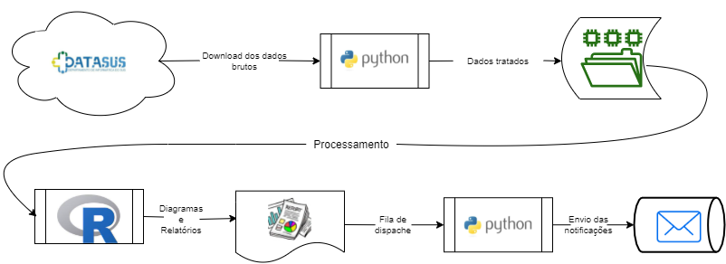

# epidemiotcc
TCC - Mineração de Informações em Epidemiologia



## Integrantes
- [José Rodrigo da Silva Inácio](mailto:jose.inacio@estudante.ifb.edu.br)
- [Josué de Paulo Viana](mailto:josue.viana@estudante.ifb.edu.br)


## Setup Python


### Instalar GDAL (Necesário para PySUS)

```bash
sudo add-apt-repository -y ppa:ubuntugis/ubuntugis-unstable
sudo apt update
sudo apt upgrade
sudo apt-get install g++
sudo apt-get install python3-dev
sudo apt install gdal-bin libgdal-dev
```

### Instalar Venv

```bash
python -m venv ./venv
venv/Scripts/activate # Windows
source venv/bin/activate # Linux
pip install GDAL==$(gdal-config --version) --global-option=build_ext --global-option="-I/usr/include/gdal" 
pip install -r requirements.txt
```

### Exportar Venv

```bash
pip freeze > requirements.txt
```

### Executando um Exemplo

```bash
python .\exemplos\lendo_yml.py
```