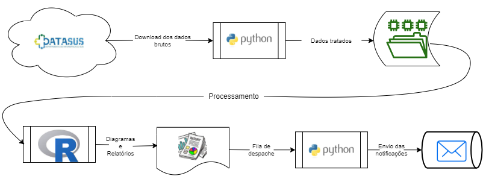

# epidemiotcc
TCC - Mineração de Informações em Epidemiologia



## Integrantes
- [José Rodrigo da Silva Inácio](mailto:jose.inacio@estudante.ifb.edu.br)
- [Josué de Paulo Viana](mailto:josue.viana@estudante.ifb.edu.br)


## Setup Python


### Instalar Venv

```bash
python -m venv ./venv
venv/Scripts/activate # Windows
source venv/bin/activate # Linux
pip install -r requirements.txt
```

### Exportar Venv

```bash
pip freeze > requirements.txt
```

### Executando um Exemplo

```bash
python .\exemplos\lendo_yml.py
```